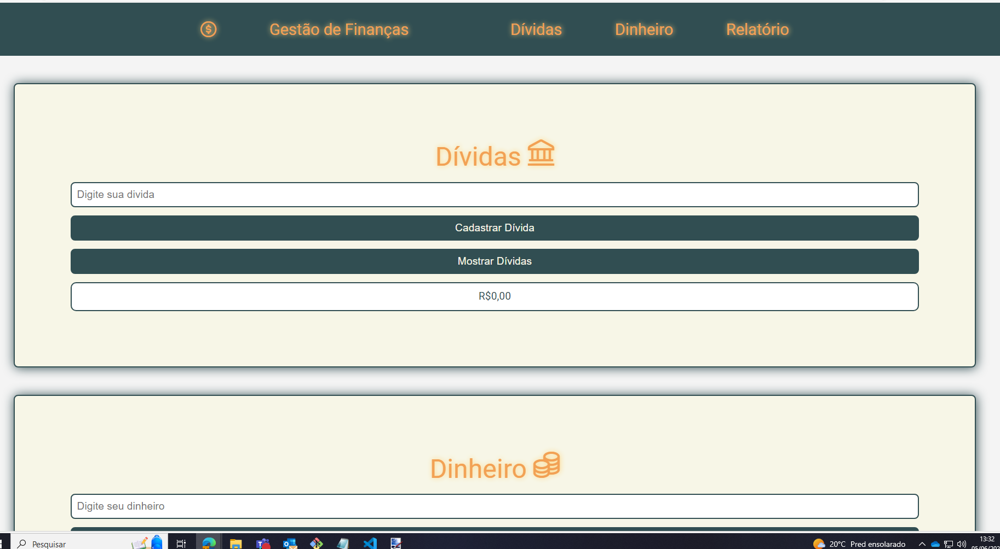

# Gestão de Finanças
Este é um projeto simples de uma aplicação web para gerenciar finanças pessoais. A aplicação permite ao usuário cadastrar dívidas e dinheiro disponível, e gerar um relatório com o saldo atual.

**Apenas DESKTOP**

## Índice
- [Visão Geral](#visão-geral)
- [Funcionalidades](#funcionalidades)
- [Tecnologias Utilizadas](#tecnologias-utilizadas)
- [Como Usar](#como-usar)

### Visão Geral

A aplicação possui uma interface simples dividida em três seções principais: Dívidas, Dinheiro e Relatório. O usuário pode adicionar dívidas e dinheiro disponível, e a aplicação calculará o saldo atual com base nas entradas.

### Funcionalidades
- Cadastrar Dívida: Permite ao usuário inserir um valor de dívida e salvar no armazenamento local.

- Mostrar Dívidas: Exibe todas as dívidas cadastradas.

- Cadastrar Dinheiro: Permite ao usuário inserir um valor de dinheiro disponível e salvar no armazenamento local.

- Mostrar Dinheiro: Exibe o total de dinheiro disponível.

- Gerar Relatório: Gera um relatório com o total de dívidas, total de dinheiro e o saldo atual.

### Tecnologias Utilizadas

- HTML5
- CSS3
- JavaScript

### Como Usar

- Clone o repositório ou faça o download do projeto.
- Abra o arquivo index.html em seu navegador.
- Utilize as funcionalidades disponíveis para gerenciar suas finanças pessoais.

---

---

